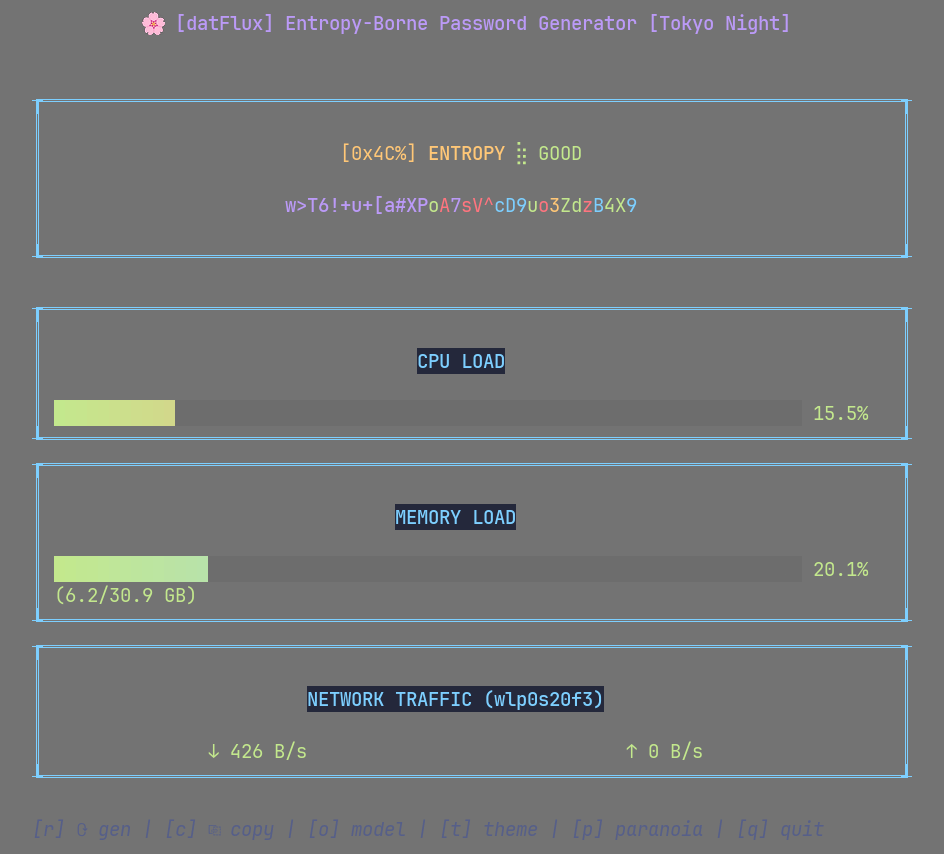

<div align="center">
  
  
  <h1>datFlux</h1>
  <p><em>An entropy-borne password generator with a Tokyo Night TUI dashboard</em></p>

  <a href="#-features"></a>
  <a href="#-installation"></a>
  <a href="#-usage"></a>
  <a href="#-security-considerations"></a>
</div>

<br><br>
  
  <p align="center" width="80%">
    datFlux is a terminal-based password generator that uses system noise as entropy<br>
    sources to create truly random passwords. It features a beautiful, responsive terminal<br>
    interface and creates cryptographically secure passwords while showing real-time system metrics.
  </p>

  <br>
</div>

<br>

## § Screenshots

<div style="display: flex; align-items: center; margin-bottom: 20px;">
  
  <em style="margin-left: 20px;">⊹ mid-animation ⊹</em>
</div>

<br>

<div style="display: flex; align-items: center; margin-bottom: 20px;">
  
  <em style="margin-left: 20px;">⊹ password generated ⊹</em>
</div>

<br>

<div style="display: flex; align-items: center; margin-bottom: 20px;">
  
  <em style="margin-left: 20px;">⊹ copy password ⊹</em>
</div>

<br>

## § System Requirements

<div align="left">
  


</div>

- **Linux**: full functionality available
- **macOS**: basic features work, but system monitoring may be limited
- **Windows**: not currently supported

<br>

> ※ For the best experience, try datFlux on a Linux system

<br>

## § Features

- **High-Entropy Password Generation**: creates strong passwords using real system noise
- **Cinematic Password Reveal Animation**: visually decrypts passwords character by character
- **System Metrics Dashboard**: live CPU, RAM, and Network usage monitoring
- **Entropy Quality Indicator**: monitors randomness quality in real-time
- **Clipboard Integration**: copy passwords to your clipboard with a single keystroke

<br>

## § Installation

### Quick Install Script (Linux/macOS)

The easiest way to install datFlux is using the installation script:

```bash
# Clone the repository
git clone https://github.com/bxavaby/datFlux.git
cd datFlux

# Run the installer
./install.sh
```

The installer will build datFlux and add it to your system path.

### From Source (Manual)

```bash
# Clone the repository
git clone https://github.com/bxavaby/datFlux.git
cd datFlux

# Build the binary
go build -o datflux ./cmd/datflux

# Run it
./datflux
```

### Go Install

```bash
go install github.com/bxavaby/datFlux/cmd/datflux@latest
```

<br>

## § Usage

Launch it in your terminal:

```bash
datflux
```

### Key Commands

- <kbd>r</kbd> - (re)generate password
- <kbd>c</kbd> - copy the generated password to clipboard
- <kbd>q</kbd> / <kbd>Ctrl+C</kbd> / <kbd>Esc</kbd> - quit datFlux

<br>

## § How It Works

datFlux creates background system load through various noise generation methods:

1. **CPU Noise**: performs complex mathematical operations
2. **RAM Noise**: allocates and manipulates memory blocks
3. **Network Noise**: creates local network connections and data transfer

These operations generate entropy that is collected, hashed, and used to create unpredictable, secure passwords that are more resistant to brute force and dictionary attacks than traditional password generators.

<br>

## § Security Considerations

- datFlux generates passwords locally; no data is sent over the network
- The program creates system load to generate entropy but has safeguards to prevent excessive resource usage
- Generated passwords never leave your computer unless you copy them

<br>

## § License

MIT License - see [LICENSE](LICENSE) for details

---

<p align="center">By <a href="https://github.com/bxavaby">bxavaby</a></p>
