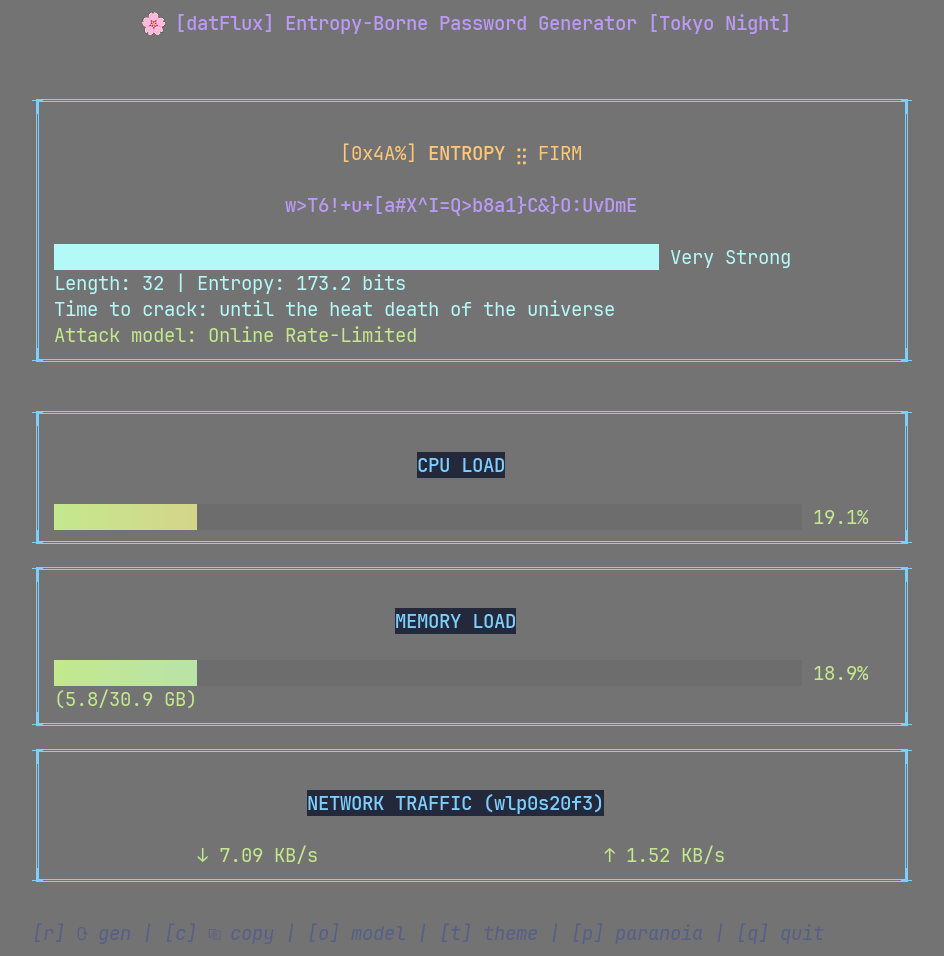
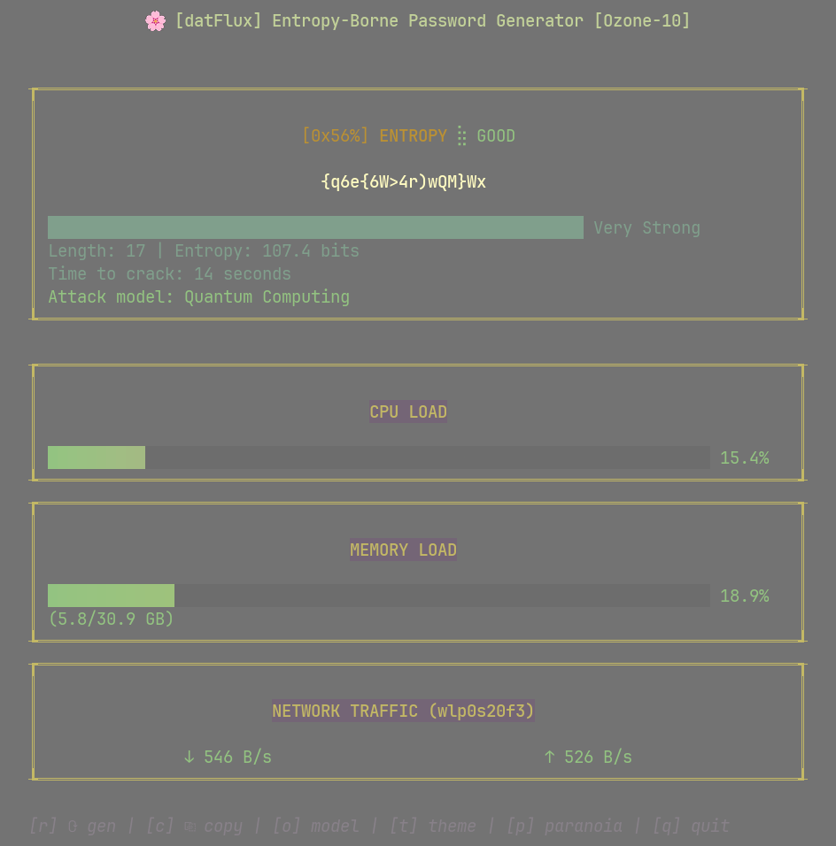
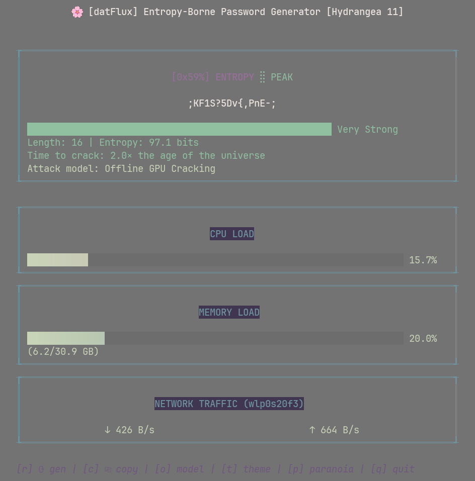
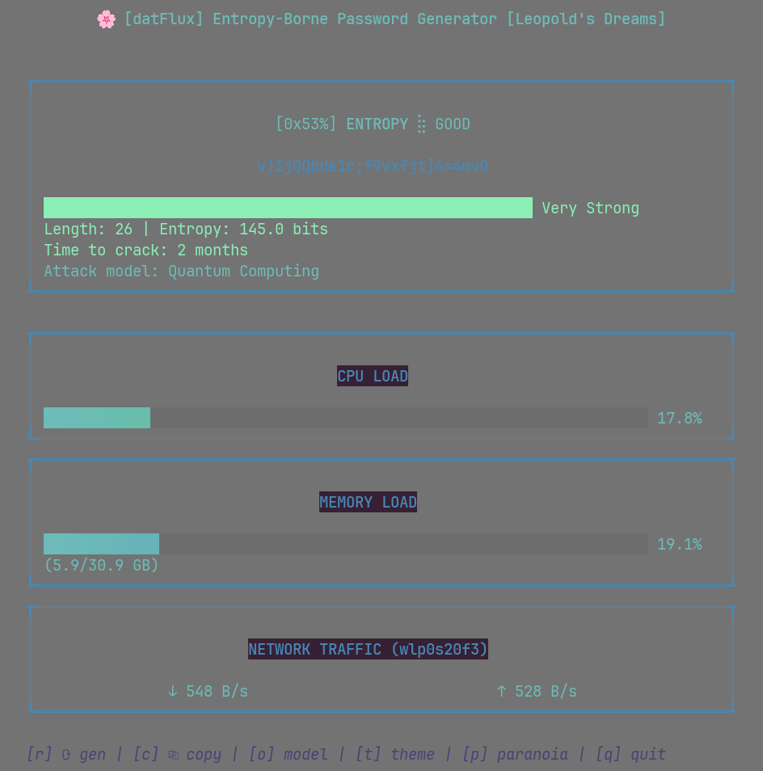
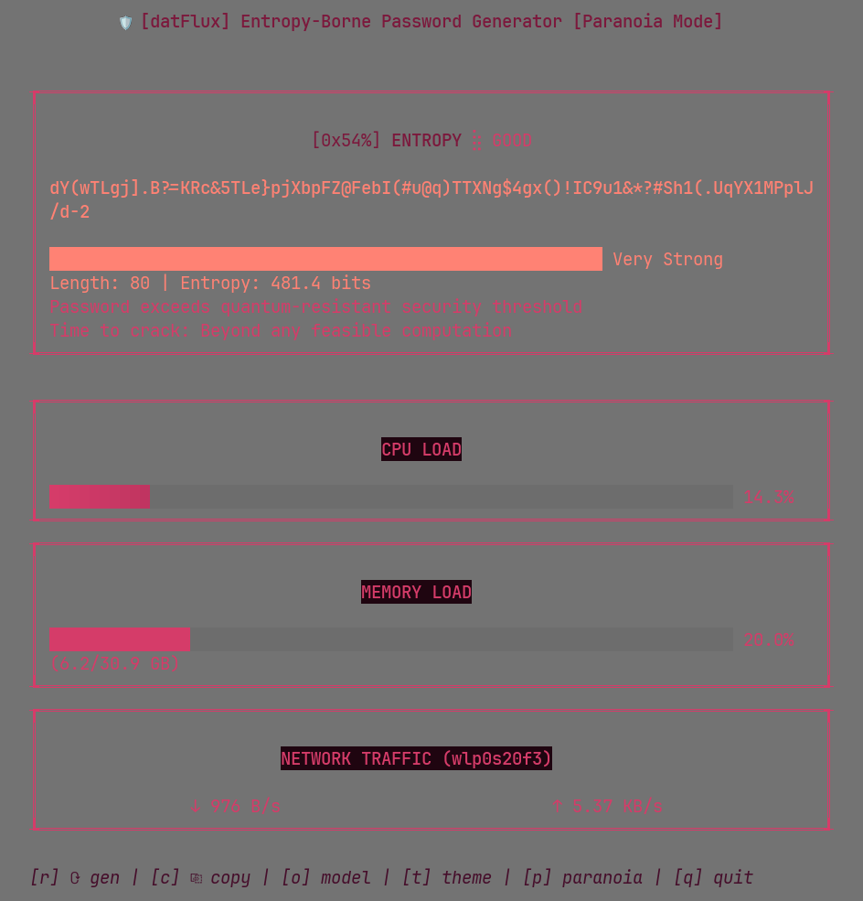
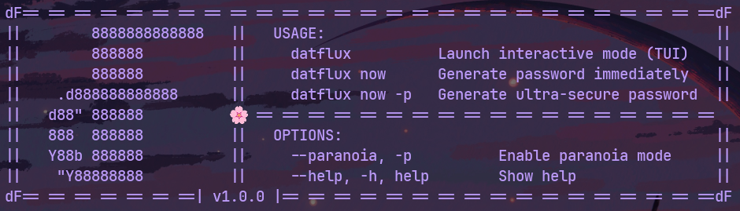

<div align="center">
  

  <h1>datFlux</h1>
  <p><em>An entropy-borne password generator with a sightly TUI dashboard</em></p>

  <a href="#-features"></a>
  <a href="#-installation"></a>
  <a href="#-usage"></a>
  <a href="#-security-considerations"></a>

  <br>
</div>

<div align="center">
  <a href="https://github.com/yourusername/datflux">
    
  </a>
  <br><br>
</div>

<div align="center">

## § Walkthrough

<br>

</div>

<div align="center">
  <h3>⊹ Password Generation ⊹</h3>
  <p><em>Mid-animation password reveal</em></p>
  
  <br><br>

  <h3>⊹ Copy to Clipboard ⊹</h3>
  <p><em>One-key operation to copy the password</em></p>
  
  <br><br>

  <h3>⊹ Strength Analysis ⊹</h3>
  <p><em>Breakdown of the password's security</em></p>
  
</div>

<br>

#

<div align="center">
  <p>datFlux comes with multiple colorschemes to match your aesthetic:</p>
  <br>

  <h3>Tokyo Night (Default)</h3>
  <p><em>Inspired by the beautiful city of Tokyo at night</em></p>
  <a href="https://github.com/enkia/tokyo-night-vscode-theme" target="_blank" rel="noopener noreferrer">
    
  </a>
  <br><br>

  <h3>Ozone-10</h3>
  <p><em>Inspired by polluted city sky colors</em></p>
  <a href="https://lospec.com/palette-list/ozone-10" target="_blank" rel="noopener noreferrer">
    
  </a>
  <p><small>by <a href="https://lospec.com/tinapxl" target="_blank" rel="noopener noreferrer">@tinapxl</a></small></p>
  <br><br>

  <h3>Hydrangea 11</h3>
  <p><em>Inspired by hydrangea flowers</em></p>
  <a href="https://lospec.com/palette-list/hydrangea-11" target="_blank" rel="noopener noreferrer">
    
  </a>
  <p><small>by <a href="https://lospec.com/dinchenix" target="_blank" rel="noopener noreferrer">@dinchenix</a></small></p>
  <br><br>

  <h3>Leopold's Dreams</h3>
  <p><em>Inspired by blueish melancholic sci-fi scenarios</em></p>
  <a href="https://lospec.com/palette-list/leopolds-dreams" target="_blank" rel="noopener noreferrer">
    
  </a>
  <p><small>by <a href="https://lospec.com/sukinapan" target="_blank" rel="noopener noreferrer">@sukinapan</a></small></p>
  <br><br>

  <h3>Midnight Ablaze (Paranoia Mode)</h3>
  <p><em>Inspired by a very ominous night sky</em></p>
  <a href="https://lospec.com/palette-list/midnight-ablaze" target="_blank" rel="noopener noreferrer">
    
  </a>
  <p><small>by <a href="https://lospec.com/inkpendude" target="_blank" rel="noopener noreferrer">@inkpendude</a></small></p>
</div>

<br><br>

> ※ Press <kbd>t</kbd> anytime to cycle between available themes. Your preference will be applied immediately without interrupting the workflow.

<br>

<div align="center">

## § System Requirements


<br>

<p>
  <strong>Linux</strong>: full functionality available<br>
  <strong>macOS</strong>: system monitoring may be limited<br>
  <strong>Windows</strong>: not currently supported
</p>

</div>

<br><br>

> ※ For the best experience, try datFlux on a Linux system.

<br>

<div align="center">

## § Features

  <p><strong>High-Entropy Password Generation</strong><br>creates strong passwords using real system noise</p>
  <br>

  <p><strong>Dual-Mode Operation</strong><br>offers both interactive TUI and efficient CLI modes</p>
  <br>

  <p><strong>Cinematic Password Reveal Animation</strong><br>visually decrypts passwords character by character</p>
  <br>

  <p><strong>Multiple Attack Models</strong><br>test against different threat scenarios from online attacks to QC</p>
  <br>

  <p><strong>System Metrics Dashboard</strong><br>live CPU, RAM, and Network usage monitoring</p>
  <br>

  <p><strong>Entropy Quality Indicator</strong><br>real-time entropy visualization with hex readout and an 8-level status feedback</p>
  <br>

  <p><strong>Clipboard Integration</strong><br>copy passwords to your clipboard with a single keystroke</p>
</div>

<br><br>

> ※ The quantum computing attack model provides time estimates with approximately 5-8% margin of error when compared to theoretical calculations. These estimates are rounded to the nearest time unit for readability.

<br><br>

<div align="center">

## § Installation

  <h3>Quick Install Script (Linux/macOS)</h3>
  <p>The easiest way to install datFlux is using the installation script:</p>

</div>

```bash
# Clone the repository
git clone https://github.com/bxavaby/datFlux.git
cd datFlux

# Run the installer
./install.sh
```

<div align="center">

  <p>The installer will build datFlux and add it to your system path.</p>
  <br>

  <h3>From Source (Manual)</h3>

</div>

```bash
# Clone the repository
git clone https://github.com/bxavaby/datFlux.git
cd datFlux

# Build the binary
go build -o datflux ./cmd/datflux

# Run it
./datflux
```

<div align="center">

<br>

  <h3>Go Install</h3>

</div>

```bash
go install github.com/bxavaby/datFlux/cmd/datflux@latest
```

<br><br>

<div align="center">

## § Usage

  <p>datFlux offers both interactive and command-line modes:</p>

  <h3>Interactive Mode</h3>
  <p>Launch the full-featured interactive terminal interface:</p>

</div>

```bash
datflux
```

<div align="center">

  <h3>Command-Line Mode</h3>
  <p>Generate passwords directly from the command line:</p>

</div>

```bash
# Standard Mode instant password generation
datflux now

# Enables Paranoia Mode in instant generation
datflux now --paranoia
```

<div align="center">

  <p>The CLI mode is perfect for quick operations, script integration, password managers, etc.</p>
  <p><small>See the <a href="#-command-line-interface">Command-Line Interface</a> section below for visual examples.</small></p>
  <br>

  <h3>Key Commands (TUI Mode)</h3>

  <p>
    <kbd>r</kbd> - generate password<br>
    <kbd>c</kbd> - copy the password<br>
    <kbd>o</kbd> - cycle attack models<br>
    <kbd>t</kbd> - cycle through themes<br>
    <kbd>p</kbd> - toggle paranoia mode<br>
    <kbd>q</kbd> / <kbd>Ctrl+C</kbd> / <kbd>Esc</kbd> - quit datFlux
  </p>
</div>

<br><br>

<div align="center">

## § Command-Line Interface

<p>Building on what's mentioned above, here are some examples of datFlux CLI in action:</p>
<br>

<h3>⊹ Instant Password Generation ⊹</h3>
<p><em>Generate passwords instantly in the CLI</em></p>

<p><small>Using `datflux now` with paranoia mode enabled via available flags</small></p>
<br><br>

<h3>⊹ Help Documentation ⊹</h3>
<p><em>Sightly formatted command usage information</em></p>

<p><small>Access help anytime with `datflux --help`, `datflux -h` or `datflux help'</small></p>
<br><br>

<h3>⊹ User-Friendly Errors ⊹</h3>
<p><em>Clear feedback for incorrect commands</em></p>

<p><small>Helpful suggestions when commands aren't recognized</small></p>

</div>

<br><br>

<div align="center">

## § How It Works

  <p>datFlux creates background system load through various noise generation methods:</p>
  <br>

  <p><strong>1. CPU Noise</strong><br>performs complex mathematical operations</p>
  <br>

  <p><strong>2. RAM Noise</strong><br>allocates and manipulates memory blocks</p>
  <br>

  <p><strong>3. Network Noise</strong><br>creates local network connections and data transfer</p>
  <br>

  <p>These operations generate entropy that is collected, hashed, and used to create unpredictable, secure passwords that are more resistant to brute force and dictionary attacks than traditional password generators.</p>
  <br>

  <p>The multi-level entropy quality gauge provides precise feedback on the randomness extraction process, ensuring you can visualize the security strength of your current entropy pool in real-time.</p>
  <br>
</div>

<br><br>

<div align="center">

## § Security Considerations

  <p>• datFlux password generation happens locally with zero network transmission</p>
  <p>• System load is optimized with safeguards to collect entropy efficiently</p>
  <p>• Your passwords remain on-device until you explicitly copy them elsewhere</p>
  <p>• Uses BLAKE2s cryptographic hashing for superior performance and security compared to traditional SHA-256</p>
  <p>• Implements the Fortuna cryptographically secure random number generator (CSRNG)</p>
  <p>• Maintains persistent entropy across sessions using a protected seed file</p>
  <p>• Employs 32 separate entropy pools for resistance against entropy compromise attacks</p>
</div>

<br><br>

<div align="center">

## § Entropy Testing Results

  <h3>The Scientific Analysis</h3>
  <p>All security claims are backed by <a href="https://github.com/bxavaby/datFlux/tree/main/test/entropy">empirical testing</a> of password entropy generation.</p>
  <br>

  <h3>Standard Mode</h3>
  <p><em>Tested across 1,000 password samples:</em></p>
  <table>
    <tr>
      <td align="right"><strong>Average Entropy:</strong></td>
      <td>136.13 bits</td>
    </tr>
    <tr>
      <td align="right"><strong>Range:</strong></td>
      <td>72.05 - 210.24 bits</td>
    </tr>
    <tr>
      <td align="right"><strong>Standard Deviation:</strong></td>
      <td>29.80 bits</td>
    </tr>
    <tr>
      <td align="right"><strong>Typical Length:</strong></td>
      <td>16-32 characters</td>
    </tr>
  </table>
  <p><small><a href="https://github.com/bxavaby/datFlux/blob/main/test/entropy/standard_mode.txt">View detailed test results</a></small></p>
  <br>

  <h3>Paranoia Mode</h3>
  <p><em>Tested across 100 password samples with 25 candidates each:</em></p>
  <table>
    <tr>
      <td align="right"><strong>Average Entropy:</strong></td>
      <td>461.01 bits</td>
    </tr>
    <tr>
      <td align="right"><strong>Range:</strong></td>
      <td>433.27 - 487.26 bits</td>
    </tr>
    <tr>
      <td align="right"><strong>Standard Deviation:</strong></td>
      <td>12.98 bits</td>
    </tr>
    <tr>
      <td align="right"><strong>Typical Length:</strong></td>
      <td>70-80 characters</td>
    </tr>
  </table>
  <p><small><a href="https://github.com/bxavaby/datFlux/blob/main/test/entropy/paranoia_mode.txt">View detailed test results</a></small></p>
</div>

<br>

<div align="center">
  
  
</div>

<br><br>

> #### Security Perspective
> * **Classical Computing**: 80 bits is considered secure
> * **Quantum Computing**: 256 bits is considered resistant
> * **datFlux Standard Mode**: 136 bits (exceeds classical requirements)
> * **datFlux Paranoia Mode**: 461 bits (exceeds quantum requirements by ~200 bits)

<br><br>

<div align="center">

## § Enhanced Security with Paranoia Mode

  <p><strong>Ultra-High Entropy Generation</strong><br>empirically verified to produce passwords with ~461 bits of entropy<br>(nearly double the quantum resistance threshold)</p>
  <br>

  <p><strong>Multi-candidate Selection</strong><br>generates and evaluates 25 password candidates in parallel,<br>applying cryptographic strength metrics for optimal selection</p>
  <br>

  <p><strong>Extended Length Range</strong><br>creates passwords of 48-80 characters (70-80 in practice)<br>with sophisticated character distribution across the entire password length</p>
  <br>

  <p><strong>Binary Stream Visualization</strong><br>features a unique animation showing entropy bits<br>transforming into your high-security password</p>
  <br>

  <p><strong>Toggle with a Single Key</strong><br>seamlessly switch between standard and paranoia modes<br>by pressing <kbd>p</kbd> any time</p>

</div>

<br><br>

> ※ Paranoia Mode uses a design parameter of 48-80 characters, but the empirical test shows that when selecting the highest-entropy candidate from 25 options, the chosen passwords typically fall in the 70-80 character range. Therefore, PM is designed for situations requiring exceptional security, such as master passwords, cryptocurrency wallets, or sensitive data encryption. While Standard Mode already provides strong security (~136 bits), PM's 461-bit entropy exceeds even theoretical quantum computing attack thresholds by a substantial margin.

<br><br>

#

<div align="center">
  <p><em>v1.0.0 — Entropy-driven security</em></p>
</div>

<div align="center">
  <p>
    <a href="https://github.com/bxavaby" target="_blank" rel="noopener noreferrer">
      
    </a>
  </p>
  <p><a href="LICENSE"></a></p>
</div>
